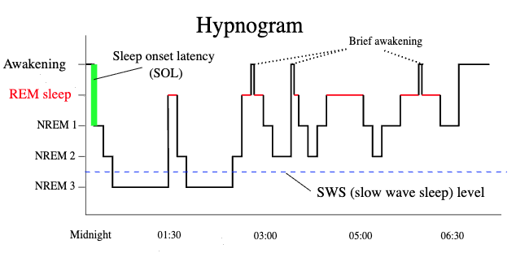

# There's Only One Way to Sleep

*How a lifelong-learning LLM independently converged on the same memory architecture that evolution discovered 500 million years ago.*

---

Look at a hypnogram — the staircase trace of a human brain descending through sleep stages across a single night. Early in the night, the signal plunges to NREM 3, the deep slow-wave sleep where damaged synapses are repaired and noisy memories are cleaned up. Between these deep dives, the brain surfaces briefly — just long enough to check that nothing has gone catastrophically wrong — then descends again. As the night wears on, the deep dives become shallower and shorter. REM sleep takes over: the phase where memories are replayed, abstracted, and woven into long-term cortical storage. By dawn, the system has shifted from repair to transfer. SWS dominates early; REM dominates late.

We didn't set out to replicate this pattern. We were trying to solve a narrower problem: how to give a language model persistent, editable memories that survive across conversations — running locally, on a laptop, without a database. We ended up building the hypnogram from scratch.

This essay argues that we had no choice. The constraints of the problem admit exactly one efficient solution, and both biological evolution and our engineering deduction found it independently. There is, in a meaningful sense, only one way to sleep.

## The problem that forces sleep into existence

The problem is deceptively simple to state: maintain a growing set of memories in a fixed-capacity substrate, while remaining available for new learning, without catastrophic interference.

Every word matters. *Growing* means the system must accept new information indefinitely. *Fixed-capacity* means it cannot simply accumulate — old and new memories must coexist in the same weights. *Available for new learning* means it cannot spend all its time reorganizing. *Without catastrophic interference* means that learning one thing must not destroy another.

This problem has been studied in neuroscience for decades. In 1995, McClelland and O'Reilly formalized it as the Complementary Learning Systems (CLS) theory: any system that needs both rapid acquisition and stable long-term retention must have two learning systems with different speeds, connected by an offline transfer mechanism. They predicted it from information-theoretic first principles. Evolution had already built it. We arrived at the same place by hitting every wall they predicted.

## Constraint 1: You need two learning systems

A system that learns instantly forgets easily. A system that retains well learns slowly. This is the stability-plasticity dilemma — you cannot have both properties in a single mechanism.

In our system, MEMIT (Mass-Editing Memory in Transformers) is the fast system. It surgically rewrites MLP weight matrices to encode new facts in a single forward pass. You tell the model "Anya lives in Prague" and the weights change immediately. Recall is instant. But MEMIT edits interfere with each other — on an 8B model, recall holds at 0.92 through 13 edits, then crashes to 0.57 at 14. A sharp phase transition, not gradual decay.

LoRA is the slow system. It fine-tunes a low-rank adapter across many training steps, then fuses the result into the base weights. It's stable and high-capacity, but slow and imprecise — and when applied during wake, RLHF actively suppresses the injected knowledge (we measured this: 47% recall at 3B, 37% at 8B, 0% at 70B — an inverse scaling law we called the alignment tax).

We tried MEMIT alone. It worked until we hit the capacity wall. We tried LoRA alone. It worked until we hit the alignment wall. The problem forced the duality: a fast, fragile system for immediate encoding, and a slow, stable system for permanent storage.

The brain's answer is the same: hippocampus for fast encoding, neocortex for slow consolidation. Not because we copied it — because the math has one solution.

## Constraint 2: You cannot consolidate and learn simultaneously

MEMIT maintenance rewrites weight matrices under null-space constraints — projecting corrections into the subspace orthogonal to all healthy memories. The model cannot serve coherent chat while its weights are being surgically modified mid-layer. This forces an offline phase.

The brain has the same constraint. Hippocampal replay during wake would be indistinguishable from hallucination — internally generated signals competing with real perception. So consolidation must happen when the system is offline from external input.

That's sleep. Not a metaphor for sleep. Not a poetic name for a batch job. A logical necessity arising from the constraint that you cannot simultaneously use a system and restructure it.

## Constraint 3: You must triage before you repair

You cannot refresh every memory — it's too expensive, and healthy edits don't need it. So you must first audit to discover which memories have degraded. This forces an assessment phase before the repair phase.

In our system, the audit step tests recall of every stored fact by prompting the model and comparing its completion against the expected answer. Facts scoring below the degraded threshold (50% recall) are flagged for maintenance. Facts that are healthy are left alone.

This is NREM 2 — the light sleep stage where the brain sorts through the day's experiences, tagging what needs deep processing and what can be discarded. You wouldn't open every patient in the hospital. You triage first.

## Constraint 4: Repair must precede transfer

You cannot train the slow system on degraded memories — garbage in, garbage out. If MEMIT's representation of "Anya lives in Prague" has decayed to the point where the model completes it as "Anya lives in Berlin," training LoRA on that fact will encode the wrong answer permanently.

So the fast system must be healthy before the slow system can learn from it. Maintenance (SWS) must precede consolidation (REM). This ordering isn't a design choice. It's forced by the dependency chain.

In our pipeline: step 4 (maintain — refresh degraded MEMIT edits with null-space constraints) must complete before step 5 (consolidate — train LoRA on active facts and fuse into weights). We didn't decide this order. We tried the reverse and got corrupted consolidations. The dependency forced it.

## Constraint 5: Integrity checks create natural awakening points

After heavy weight modification — whether MEMIT refreshes or LoRA fusing — you must verify the model is still coherent. We measure perplexity on a reference corpus before and after. If PPL increases beyond the threshold (15%), we roll back.

This checkpoint is a brief awakening. The system surfaces just long enough to ask "am I still OK?" before descending back into the next operation. If the answer is no, the cycle terminates early — a protective mechanism against cumulative drift.

Look at the hypnogram again. Between each NREM cycle, the trace rises briefly toward wakefulness — sometimes all the way to a momentary awakening — before descending again. These aren't failures of sleep. They're integrity checks. The brain is verifying that it hasn't destabilized itself.

## Constraint 6: The SWS-to-REM shift emerges for free

Here is perhaps the most striking convergence. In human sleep, the early night is dominated by deep slow-wave sleep (repair and cleanup), and the late night is dominated by REM (memory replay and consolidation). This shift is visible in the hypnogram: the NREM 3 dips get shallower as the night progresses, while the REM blocks (shown in red) get longer.

We didn't design this shift into our system. It emerged from the math.

In early sleep cycles, there are many degraded facts. Maintenance (our SWS analog) dominates because there's a lot to repair. But as the system stabilizes — healthy facts stay healthy, degraded facts get refreshed — there's progressively less repair work. Consolidation (our REM analog) fills the remaining time. By the third or fourth cycle, maintenance is a no-op and consolidation does all the work.

We measured this directly: after 12+ sleep cycles on the 70B model, zero facts were flagged as degraded. The maintenance step ran but found nothing to do. Consolidation advanced every fact through its staging pipeline (MEMIT scale 1.0 → 0.5 → 0.1 → 0.0) until the MEMIT edits dissolved entirely and LoRA carried all the knowledge.

The SWS-to-REM shift isn't a design parameter. It's an emergent property of the constraint structure.

## Why convergence is inevitable

These six constraints aren't six independent design choices. They're all consequences of three properties:

**Finite capacity** → interference between memories → need to repair (SWS).

**Dual learning rates** → fast system must feed slow system → need to transfer (REM).

**Offline processing** → limited time budget → need to triage (NREM 2) → repair before transfer (SWS before REM) → verify before continuing (brief awakenings).

Every branch is forced. There is no fork where a different choice leads to a viable alternative. We know because we tried the alternatives:

- MEMIT alone: capacity wall at 13–15 facts.
- LoRA alone: alignment tax kills recall at scale.
- No triage: wasted compute refreshing healthy facts.
- Transfer before repair: corrupted consolidations.
- No integrity checks: cumulative PPL drift destabilizes the model.
- No offline phase: weight surgery during inference produces incoherent outputs.

Each failed alternative pushed us toward the same architecture. Not gradually — we didn't drift toward it. Each failure eliminated a degree of freedom until only one design remained.

## Convergent evolution

Wings evolved independently in birds, bats, and insects — not because they copied each other, but because the physics of generating lift in an atmosphere has one solution shape: a broad surface, an airfoil cross-section, and an attack angle. The details differ (feathers vs. membrane vs. chitin), but the functional architecture converges because the constraints converge.

Sleep architecture is the same. The information theory of memory consolidation in a finite substrate has one solution shape: a fast encoding system, a slow storage system, an offline transfer phase, triage before repair, repair before transfer, integrity checks between stages, and an emergent shift from repair-dominant to transfer-dominant processing as the system stabilizes.

The human brain implements it with hippocampal sharp-wave ripples, thalamocortical spindles, and neocortical slow oscillations. We implement it with MEMIT null-space projections, LoRA per-fact gating, and PPL-gated rollbacks. The mechanisms are completely different. The architecture is identical.

We didn't set out to build a sleeping brain. We set out to give a language model persistent memory on a laptop. But the problem has one solution, and when you follow the constraints honestly — when you let each failure eliminate a wrong path instead of patching around it — you end up in the same place evolution did.

There's only one way to sleep. We just proved it from the engineering side.
